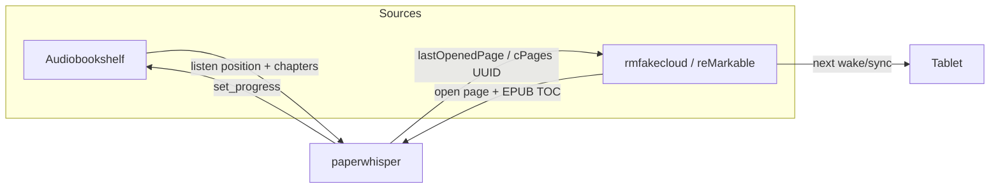

# paperwhisper

**Whispersync-style reading-progress sync** between a [reMarkable](https://remarkable.com/) tablet (via [rmfakecloud](https://github.com/ddvk/rmfakecloud)) and [Audiobookshelf](https://www.audiobookshelf.org/).

Listen to an audiobook, and the matching ebook on your reMarkable opens near the same spot. Read on the tablet, and Audiobookshelf picks up there. Self-hosted; no Kindle/Audible account.

> [!IMPORTANT]
> This was vibecoded against one homelab. It works there. It is **not** security-audited.
> `audio_to_ebook` **writes into rmfakecloud's sync store**. Keep `DRY_RUN=true` until
> the logs look right, and keep a backup of rmfakecloud's data dir. MIT, issues/PRs welcome.

**Contents**

- [What it does](#what-it-does)
- [How it works](#how-it-works)
- [The logic](#the-logic)
- [Getting started](#getting-started)
- [Configuration](#configuration)
- [Ebook providers](#ebook-providers)
- [Honest limitations](#honest-limitations)
- [Roadmap](#roadmap)

---

## What it does

One process, one direction (`DIRECTION`):

| Direction | You do this | paperwhisper does this | reMarkable store |
|---|---|---|---|
| **`ebook_to_audio`** | Read on the tablet | Sets Audiobookshelf to that spot | **read-only** |
| **`audio_to_ebook`** | Listen in Audiobookshelf | Sets the ebook's open page in rmfakecloud | **writes** |

To go both ways, run **two containers** with isolated state directories (see [step 10](#10-optional--run-both-directions)).

The tablet is **not** pushed live. paperwhisper writes rmfakecloud; the Paper Pro pulls the new page the next time it syncs (wake / reconnect). MQTT to Home Assistant is optional status only — it does not drive the tablet.

---

## How it works

Every pass is the same pipeline:

```
1. Load ebooks (rmfakecloud blob store) and audiobooks (ABS API)
2. Fuzzy-match each pair by title + author
3. Map the source position onto the target (chapter-aware, then percent)
4. Apply a small lag so the target is slightly *behind* the source
5. Skip if it would rewind, or if the move is tiny
6. Write (or log, if DRY_RUN=true)
```



**`audio_to_ebook` is event-driven.** paperwhisper subscribes to Audiobookshelf's Socket.io `user_item_progress_updated` stream, waits until listening has been quiet for `EVENT_DEBOUNCE` seconds (or `EVENT_MAX_WAIT` of continuous playback), then writes rmfakecloud. A backup poll (`INTERVAL`) still runs if the socket drops.

**`ebook_to_audio` polls** every `INTERVAL` seconds (the tablet has no equivalent live event).

---

## The logic

### 1. Match the ebook to the audiobook

Titles never agree (`The Martian: A Novel` vs `The Martian (Unabridged)`). paperwhisper:

1. Strips edition noise (`a novel`, `unabridged`, `edition`, …) and leading *the/a/an*.
2. Scores titles with a blend of sequence similarity and token overlap (so *Harry Potter and the Prisoner of Azkaban* does **not** match *Harry Potter and the Sorcerer's Stone* just because they share a prefix).
3. Modestly boosts the score if authors overlap.
4. Takes the best candidate above `MATCH_THRESHOLD` (default `0.72`).

No match → that book is skipped (`no audiobook match for …`).

### 2. Map a position (chapter-aware, then percent)

This is the accuracy path. We do **not** do `round(percent × pages)` first.

**Tier 1 — paired chapters (EPUBs).** Fetch ABS `media.chapters`. Parse the tablet's `.epub` nav (EPUB3) or NCX (EPUB2). Weight each spine document by visible text length so a long chapter gets more pages than a short one. Pair chapters by:

1. Chapter number (`Chapter 5` ↔ `Chapter 5: SOL`, `CHAPTER ONE` ↔ `Chapter 1 - The Boy Who Lived`)
2. Fuzzy title (`The Riddle House` ↔ `1. The Riddle House`)
3. Equal body-chapter count, in order, if titles mostly agree

Opening/end credits, dedication, title page, “about the author”, etc. are skipped so Full-Cast extra tracks don't shift every chapter by one.

Then interpolate **inside** the matched chapter:

```
listening 40% of the way through ABS "Chapter 12"
        → 40% of the way through the ebook's "Chapter 12" page range
        → minus PAGE_LAG (default 1 page)
```

That is what stops front matter / opening credits from dropping you in the wrong chapter.

**Tier 2 — ABS chapters, no TOC** (PDFs, or an EPUB we couldn't parse). Split the ebook's pages by each audiobook chapter's duration. Still clamped to the current chapter.

**Tier 3 — percentage.** `floor(progress × pages)` or `progress × duration`. Used when chapters don't pair (coverage below 50%, or fewer than 3 pairs).

The MATCH log tells you which tier ran:

```
… -> ebook page 72/377 (was 70) [ch 'The Weighing of the Wands' 40%]
… -> ebook page 160/508 (was 161) [percent]
```

`[ch 'Title' 40%]` = interpolated inside that paired chapter. `[percent]` = fallback.

### 3. Land slightly behind

You asked the ebook to be a page behind so you turn **forward**, not back. Defaults:

| Knob | Default | Meaning |
|---|---|---|
| `PAGE_LAG` | `1` | Open 1 page before the mapped page |
| `AUDIO_LAG` | `15` | Start 15 seconds before the mapped time |

Lag will not cross a chapter boundary — if you just started Chapter 12, you stay on Chapter 12's first page, not the end of 11.

`floor` (not `round`) is applied first, so even with both lags at `0` you still don't round up into the next page.

### 4. Don't clobber progress

- **`ALLOW_REWIND=false`** (default): never move the target *backwards*. If the tablet is ahead of ABS, audio→ebook is a no-op for that book (and vice versa). Those skips are `debug` so they don't spam every poll.
- **`MIN_PAGE_DELTA` / `MIN_DELTA`**: ignore 0-page / sub-1% jitters.
- **`MIN_PROGRESS`**: ignore books you've barely opened.
- **State file**: we remember the last source position we already pushed, so the same listen tick doesn't rewrite rmfakecloud every poll.
- **`DRY_RUN=true`**: log the MATCH and the page/time we *would* write. Nothing is written.

### 5. How the reMarkable page is stored

rmfakecloud is a content-addressed sync 1.5 blob store:

```
root                → hash of the root index
<root index>        → schema 4 + summary + one line per document
<doc-hash>          → schema 3 + one line per file (.metadata, .content, .epub, …)
<uuid>.content      → title, authors, pageCount, cPages
<uuid>.metadata     → lastOpenedPage, lastModified
```

- Older docs / some Harry Potter files: integer `lastOpenedPage`.
- Paper Pro converted EPUBs: the reader actually uses **`cPages.lastOpened.value`** (a page UUID). paperwhisper prefers that, and writes both.

Writes: device token → user token → rewrite the leaf blobs → Merkle rollup → `PUT /sync/v3/root` with compare-and-swap on the generation and `Broadcast: true`. The tablet applies it on its **next sync**, not instantly.

---

## Getting started

### 0. What you need

- Docker with Compose.
- [Audiobookshelf](https://www.audiobookshelf.org/) already running, with the same books as audiobooks.
- [rmfakecloud](https://github.com/ddvk/rmfakecloud) already running, with those books as ebooks on the tablet.
  - **Paper Pro:** use rmfakecloud's `installer-rmpro.sh`. That installs a local HTTPS proxy on the tablet (`localhost:443`). The tablet talks to rmfakecloud through that proxy — there is no MQTT live-push path for the Paper Pro.
- The **same title** (close enough to fuzzy-match) on both sides. Sync one pair you care about first and watch the logs.

### 1. Clone

```bash
git clone https://github.com/brandonjones24/paperwhisper.git
cd paperwhisper
cp .env.example .env
cp docker-compose.example.yml docker-compose.yml
```

### 2. Pick a direction

Start with **one** direction. Read-only on the tablet is the safer first run:

```bash
# in .env
DIRECTION=ebook_to_audio    # tablet → Audiobookshelf (recommended first)
# DIRECTION=audio_to_ebook  # Audiobookshelf → tablet (writes rmfakecloud)
DRY_RUN=true
```

### 3. Fill in Audiobookshelf

In Audiobookshelf: **Settings → Users → your user → API Token**.

```bash
ABS_URL=http://audiobookshelf:13378    # whatever reaches ABS from the container
ABS_TOKEN=paste-the-api-token
```

If ABS is on HTTP inside your LAN, leave `ABS_VERIFY_TLS=true` (it only matters for HTTPS).

> Socket.io (used by `audio_to_ebook` events) cannot authenticate with an API key
> directly. paperwhisper exchanges the API token for a user session token itself.
> You still only configure `ABS_TOKEN`.

### 4. Point at rmfakecloud's data

In `.env`:

```bash
RMFAKECLOUD_USER=your-rmfakecloud-username    # folder name under users/
RMFAKECLOUD_DATA=/rmdata                      # path *inside* the container
```

In `docker-compose.yml`, mount the **host** data dir read-only. It must contain `users/<user>/sync`:

```yaml
volumes:
  - /home/you/rmfakecloud/data:/rmdata:ro
  - ./state:/state
```

### 5. If you chose `audio_to_ebook`, add a device token

paperwhisper has to call rmfakecloud's HTTP API as a device.

```bash
DIRECTION=audio_to_ebook
RMFAKECLOUD_URL=http://rmfakecloud:3050     # rmfakecloud HTTP API
RMFAKECLOUD_DEVICE_TOKEN=paste-device-token
```

To get a device token, register [rmapi](https://github.com/ddvk/rmapi) against your rmfakecloud once, then either paste `devicetoken` from `~/.rmapi` or mount that file:

```bash
RMAPI_CONFIG=/rmapi/rmapi.conf
```

```yaml
volumes:
  - /home/you/rmfakecloud/data:/rmdata:ro
  - ./state:/state
  - /home/you/.rmapi:/rmapi:ro
```

Also back up rmfakecloud's data dir before the first real write.

### 6. Start in dry-run

```bash
docker compose up -d --build
docker compose logs -f
```

You should see a startup line like:

```
paperwhisper starting | direction=ebook_to_audio … dry_run=True … chapter_map=True page_lag=1 audio_lag=15.0s …
DRY_RUN is on — no changes will be written.
```

### 7. Read the MATCH lines

Leave it running. Open a book on the tablet (or listen in ABS, if that's your direction). Within one `INTERVAL` (default 5 minutes) — or ~20s after you pause listening, for `audio_to_ebook` — you want:

```
# tablet → ABS
MATCH 'The Martian: A Novel'<->'The Martian' (100%) ebook 41.2% -> 12894s (abs 0s, d41.2%) [ch 'Chapter 12' 40%]
[DRY_RUN] would set 'The Martian' to 12894s

# ABS → tablet
MATCH 'The Martian'<->'The Martian: A Novel' (100%) audio 31.7% -> ebook page 161/508 (was 0) [ch 'Chapter 8' 12%]
[DRY_RUN] would set 'The Martian: A Novel' to page 161
```

What to check:

| Log | Meaning |
|---|---|
| `MATCH … (100%)` / `(85%)` | Fuzzy title+author score. Below `MATCH_THRESHOLD` → no write. |
| `[ch 'Chapter 12' 40%]` | Landed inside a paired chapter. This is the good path. |
| `[percent]` | TOC/chapters didn't pair. Still writes, less accurate. |
| `no audiobook match for '…'` | Titles/authors too different. Rename one side, or lower `MATCH_THRESHOLD` slightly. |
| `skip: would rewind` (only at `LOG_LEVEL=DEBUG`) | Target is already ahead. Expected with `ALLOW_REWIND=false`. |

If the **wrong book** matched, stop. Don't flip `DRY_RUN`. Fix titles or raise `MATCH_THRESHOLD`.

### 8. Go live

```bash
# in .env
DRY_RUN=false
```

```bash
docker compose up -d
docker compose logs -f
```

Same MATCH lines, without `[DRY_RUN]`. For `audio_to_ebook`, pause the audiobook, wait ~20s, then **wake the tablet** (or wait for its next sync). The open page updates after that sync, not while you stare at an already-open book — close and reopen the ebook if it was already on screen.

### 9. Optional — Home Assistant MQTT

This publishes sync status as an HA device. It does **not** replace rmfakecloud and it does **not** push pages to the Paper Pro.

```bash
MQTT_HOST=mqtt.example
MQTT_PORT=1883
MQTT_USER=
MQTT_PASSWORD=…
MQTT_PREFIX=paperwhisper
MQTT_DISCOVERY=homeassistant
```

Restart. Sensors appear under device `paperwhisper` via MQTT discovery.

### 10. Optional — run both directions

One process handles one direction. For both, run two services with **separate state dirs** (the state file is per-book and would otherwise overwrite itself):

```yaml
services:
  paperwhisper-audio2ebook:
    build: .
    env_file: .env
    environment:
      - DIRECTION=audio_to_ebook
      - DRY_RUN=false
      - STATE_FILE=/state/paperwhisper.json
    volumes:
      - /path/to/rmfakecloud/data:/rmdata:ro
      - ./state:/state
    restart: unless-stopped

  paperwhisper-ebook2audio:
    build: .
    env_file: .env
    environment:
      - DIRECTION=ebook_to_audio
      - DRY_RUN=false
      - STATE_FILE=/state/paperwhisper.json
    volumes:
      - /path/to/rmfakecloud/data:/rmdata:ro
      - ./state-ebook2audio:/state
    restart: unless-stopped
```

Bring the second one up in `DRY_RUN=true` first, same as step 6–8.

`ALLOW_REWIND=false` on both sides is what stops them from fighting: each side only ever advances the other.

### 11. Optional — Calibre-Web / KOReader (no reMarkable)

If you read on KOReader (Kindle/Kobo/etc.) synced to Calibre-Web, paperwhisper can drive Audiobookshelf from that progress. Tablet writes are not implemented on this provider.

```bash
DIRECTION=ebook_to_audio
EBOOK_PROVIDER=calibreweb
CALIBRE_LIBRARY=/calibre-library
CWA_APP_DB=/config/app.db
```

Mount the Calibre library (for `metadata.db` + ebook files) and Calibre-Web's `app.db`. Mapping is percentage + `AUDIO_LAG` only — there is no EPUB TOC path here.

---

## Configuration

Full list: [`.env.example`](.env.example). Compose skeleton: [`docker-compose.example.yml`](docker-compose.example.yml).

| Variable | Default | Purpose |
|---|---|---|
| `RMFAKECLOUD_DATA` | `/rmdata` | rmfakecloud data dir inside the container |
| `RMFAKECLOUD_USER` | — | rmfakecloud username (`users/<user>`) |
| `ABS_URL` / `ABS_TOKEN` | — | Audiobookshelf base URL + API token |
| `ABS_VERIFY_TLS` | `true` | Verify HTTPS when ABS is TLS |
| `DIRECTION` | `ebook_to_audio` | `ebook_to_audio` or `audio_to_ebook` |
| `EBOOK_PROVIDER` | `remarkable` | `remarkable` or `calibreweb` |
| `RMFAKECLOUD_URL` | — | rmfakecloud HTTP API (required to write) |
| `RMFAKECLOUD_DEVICE_TOKEN` / `RMAPI_CONFIG` | — | device token for writes |
| `INTERVAL` | `300` | Backup poll, seconds. `0` = events-only (or run-once) |
| `ABS_EVENTS` | on for `audio_to_ebook` | Subscribe to ABS Socket.io progress events |
| `EVENT_DEBOUNCE` | `20` | Quiet-listening seconds before writing rmfakecloud |
| `EVENT_MAX_WAIT` | `120` | Force a write if events keep arriving this long |
| `DRY_RUN` | `true` | Log intended changes; write nothing |
| `MATCH_THRESHOLD` | `0.72` | Fuzzy title+author cutoff (0–1) |
| `MIN_DELTA` | `0.01` | `ebook_to_audio`: min fractional move before writing |
| `MIN_PAGE_DELTA` | `1` | `audio_to_ebook`: min page move before writing |
| `MIN_PROGRESS` | `0.005` | Ignore items barely started |
| `ALLOW_REWIND` | `false` | If false, only ever advance the target |
| `CHAPTER_MAP` | `true` | Pair ABS chapters with the EPUB TOC |
| `PAGE_LAG` | `1` | Pages to land behind the mapped page |
| `AUDIO_LAG` | `15` | Seconds to land behind the mapped time |
| `STATE_FILE` | `/state/paperwhisper.json` | Last-pushed positions |
| `LOG_LEVEL` | `INFO` | `DEBUG` to see rewind skips |
| `MQTT_HOST` | empty | Set to enable HA MQTT status |

---

## Ebook providers

The ebook side is pluggable (`EBOOK_PROVIDER`). You don't need a reMarkable:

| Provider | Reads progress from | Directions |
|---|---|---|
| **`remarkable`** (default) | rmfakecloud sync store (`lastOpenedPage` / `cPages`) | ebook ↔ audio |
| **`calibreweb`** | Calibre-Web KOReader **`kosync`** progress (`app.db`) | ebook → audio |

`calibreweb` hashes each Calibre library file with KOReader's partial-MD5, looks that hash up in `kosync_progress`, and maps the stored percentage onto the matching audiobook. `CALIBRE_LIBRARY` may list several libraries, comma-separated.

---

## Honest limitations

- **Chapter-aware, not word-accurate.** Real Whispersync aligns audio to text. We pair chapters and interpolate. Narration pace still varies, so you land *near* the right spot — slightly behind by default — not on a specific word.
- **PDFs have no EPUB TOC**, so they use duration-weighted chapter bands or percent.
- **`audio_to_ebook` writes the sync tree.** Every write is a compare-and-swap on the root generation. A bad root is rejected by the tablet (recoverable by restoring the previous root). Keep backups.
- **Page counts appear after the tablet has indexed the book** (background, after sync — you usually don't need to open each book).
- **The tablet must sync to see a new page.** Close/reopen the book if it was already open; in-memory position won't reload mid-read.
- **Same book on both sides.** No match, no sync.

---

## Roadmap

- Live tablet push (Paper Pro HTTPS proxy) so a page update doesn't wait for wake/sync.
- PDF outline / bookmark mapping.
- Write-back for the `calibreweb` provider.
- One process, both directions (namespaced state).
- Hash-index caching for large Calibre libraries; manual match overrides.
- Prometheus metrics.

---

## License

[MIT](LICENSE) © 2026 Brandon Jones. Not affiliated with reMarkable, rmfakecloud, or Audiobookshelf.
